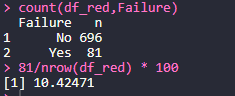

# Machine-Failures-Dataset
Introductory Project to R language using a Machine Failures Datased and programmed in RStudio Cloud.

## Main Files:
- code: notebook_proyecto.Rmd
- dataset: DataSetFallosMaquina.csv

## Read DataSet and Analysis of data

    df <- read.csv(file = 'DataSetFallosMaquina.csv',sep=';')
    glimpse(df)
    skim(df)
    knitr::kable(skim(df))
    
 
 
 
 
    
  As we can see, this dataset was originally created to extract rules to determine the conditions under which a machine will fail. It includes 20 columns, where the first 19 represent the attributes of each instance (elements X) and they are taking two types of dates: 'in' and 'fct' (factors); and one factor value 'Failure' what can be [No,Yes] and it will be our target (element Y).
  
  After getting information about the datas, it can be seen that there are some problems with the variables:
  
  - Measure2 and Measure3 are integer values, but there are few different values from each other, so this leads us to think that they are factors instead of integers.
  - Seeing the p0 (minimun) and p25 values of 'Temperature' it seems it has atypical values.
  
  We can also conclude that there aren't null values, so we will not have to drop any characteristic.
  
## Temperature Analysis

     ggplot(df,x=1) + geom_boxplot(aes(y=Temperature))

  
  The conclusion seeing this bloxplot is that most of the values are concentrated in the p25 and p75 but there are four points that are very atypical (because they are under 60º).
  
  So, to fix this problem, I'm going to remove the temperature values under 60º and I'll transform Measure2 and Measure3 in factors variables.
  
    df <- df %>%
    mutate(Measure2 = as.factor(Measure2), 
         Measure3 = as.factor(Measure3)) %>% 
         filter(Temperature > 50) 
         
         

  We show a new Temperature's boxplot without the atypical values:
  

## E.D.A.: Exploratory data analysis

Factor variables:

    df %>%
    select_if(is.factor) %>%
    gather() %>%
    ggplot(aes(value)) + geom_bar() + facet_wrap(~key,scales='free') +
    theme(axis.text=element_text(size=6))

Integer variables:

    df %>%
    select_if(is.integer) %>%
    gather() %>%
    ggplot(aes(value)) + geom_density() + facet_wrap(~key,scales='free') +
    theme(axis.text=element_text(size=6))

  
## Correlation Analysis

    df %>%
    select_if(is.integer) %>%
    cor() %>% 
    round(digits = 2)
    
  It is also interesting to know if there is a linear correlation between the input characteristics as we can decide whether to remove some redundant characteristics or not. To do this, we do a correlation analysis:
 

  We can see that all the attributes provide us information. The values in the correlation matrix vary in a range of [-1,1]. However, a high negative correlation demostrates a connection between two characteristics in the same way as a positive correlation.
  
## Balance the dataset

  Referring to the exploratory data analysis of the factor variables, we noticed that the 'Failure' variable is really imbalanced.
  
  There is 8699 predictions where the machine doesn't fail and otherwise there is only 81 times where the machine fails. In consecuense, we take the risk that our model will 'accommodate' and predict always a 'No'. 
  
  To avoid is, we wel try to achieve and ideal balanced dataset using a undersampling technique. The simplest undersampling technique involves randomly selecting from the majority class and deleting them from the dataset.
  
## Undersampling dataset

    df_nos <- df %>%
    filter(Failure == 'No') %>%
    sample_frac(size = 0.08)

    df_sis <- df %>% filter(Failure == 'Yes')

    df_red <- rbind(df_nos,df_sis)
  
Now we have a more balanced dataset with 80% No's and 20% Yes's.

## Logistic Regression
—— Machine Failure Prediction based on Logistic Regression.

  We should divide the dataset in training, validation and test datasets; but we will not do it in this case because we are using a very simple dataset.
  
  - We separate the variables from the dataset:
  
    indep <- names(df_red)[-20]
    
    formula <- reformulate(indep,target)
  
  - We use a Logistic Regression to model the dataset because we want a result between [0,1] == [No,Yes].
  We use the glm functions in R:
  
    rl <- glm(formula,df_red,family=binomial(link='logit'))
    
    summary(rl)
    
   

We see that there is only three predictive variables, those which have one ore more '*'.
[NOTE: '*' indicates that it is a predictor variable at a 95% confidence level]

Therefore we remove all the attributes which don't contribute with predictive information.

    indep_fin <- c('Temperature','Humidity','Measure9')
    formula <- reformulate(indep_fin,target) #actualizamos la fórmula

    rl <- glm(formula,df_red,family=binomial(link='logit'))
    summary(rl)
    
      

## Apply the model

  We apply the model to our dataset, making a prediction taking into account the variables of the model over the total data.

    df$scoring <- predict(rl,df,type='response')
    head(df$scoring)
    
         
    
  As we can see with the previous image, we have obteined an initial results with a 1% of probability that the machine fails. So, we determine a cut-off-point above 80%. If this condition is met, we will determine that the machine will fail.
  
    df$prediccion <- ifelse(df$scoring > 0.8,1,0)
    table(df$prediccion)
    
  We contrast the prediction with reality.
  
    table(df$prediccion,df$Failure)
  
 

This confusion matrix allows the visualization of the performance of the model, where the horizontal axis (columns) represent the values that the model has predicted,while the vertical axis corresponds to the real values of the labels.

  

  
  

